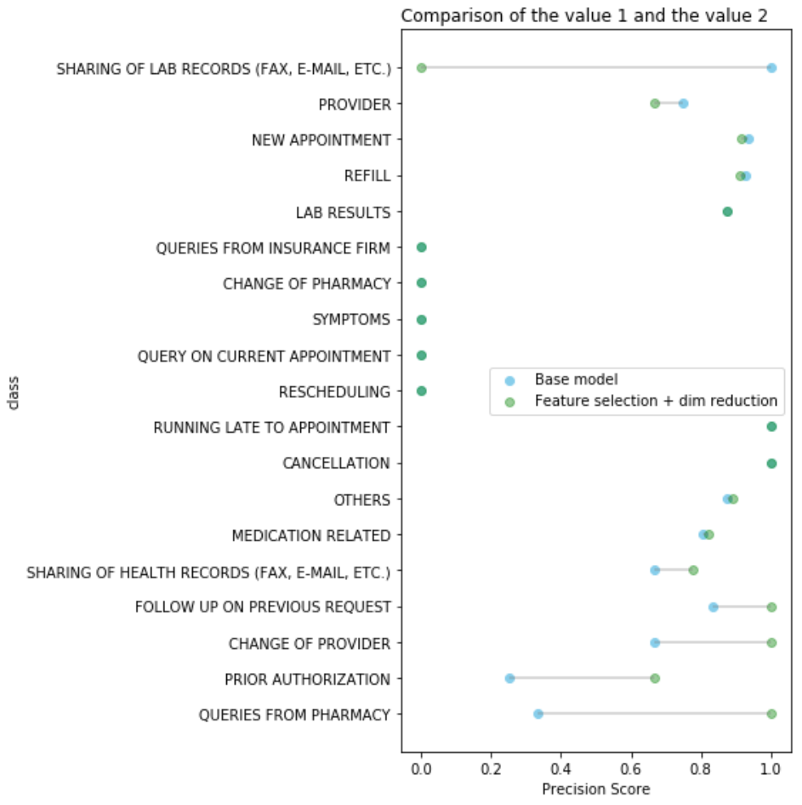

# XGBoost
A machine-learning pipeline (sklearn) using the gradient boosted trees algorithm XGBoost.

<br>

___
## [Text classification](xgboost_textclassification_example.ipynb)
### 1. Sklearn pipeline using custom regex and text cleaning functions.
```
text_clf = Pipeline(steps=[ ('replace_date',pipelinize(replace_date)),
                            ('clean',pipelinize(clean_text)),
                            ('vect', vect),
                            ('tfidf', tfidf),
                            ('clf', xgb),
                          ])
```
### 2. Hyperparameter tuning using grid-search and random-search.  
### 3. Model metrics
<br> 

___
## [Feature Selection & Dimensionality Reduction](xgboost_featureselection_dimreduction.ipynb)

Large datasets are computationally expensive, so feature reduction was explored. Sklearn defines the implemenation as:

> "The classes in the sklearn.feature_selection module can be used for feature selection/dimensionality reduction on sample sets, either to improve estimators’ accuracy scores or to boost their performance on very high-dimensional datasets." [Source](https://scikit-learn.org/stable/modules/feature_selection.html)


<br>  

### 1. Pipeline was tuned using different feature selection techniques.
```
parameters = {
                'feature_selection':[feature_SelectFpr, feature_SelectFdr, feature_SelectFwe],
                'feature_selection__alpha':[0.1,0.05,0.01],
                #'pca':[None, pca],
                
             }
```
### 2. Create model using highest weighted-f1 parms
### 3. Apply principal component analysis (PCA)

PCA is used to reduce model to a lower dimensional space, helpling to find the most significant features in a dataset. Sklearn's TruncatedSVD was used as it:

> "This transformer performs linear dimensionality reduction by means of truncated singular value decomposition (SVD). Contrary to PCA, this estimator does not center the data before computing the singular value decomposition. This means it can work with sparse matrices efficiently." [Source](https://scikit-learn.org/stable/modules/generated/sklearn.decomposition.TruncatedSVD.html)


<br>  

### 4. Comparison of model results

Per-class precision score is higher for model using feature selectin and dimensionality reduction.  
<br>
<p align="center">

</p>
